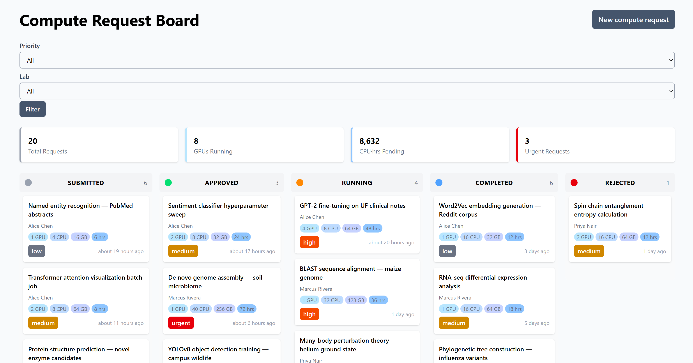
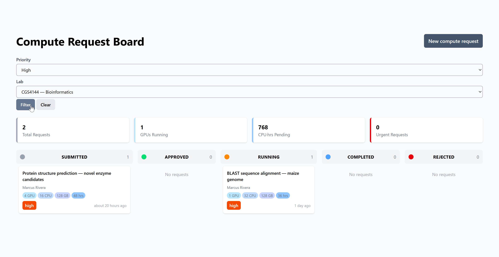
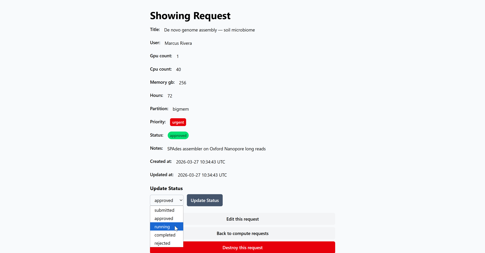
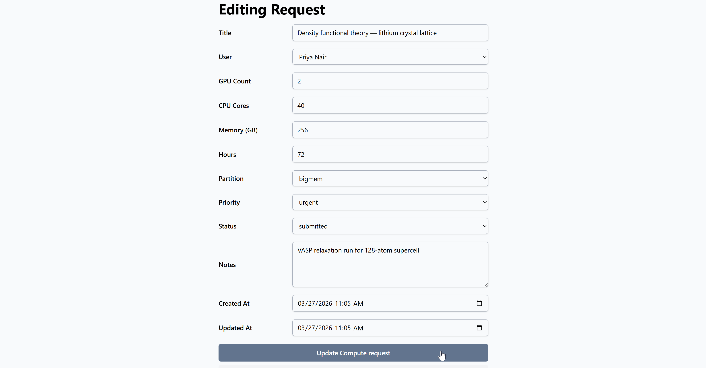

# Compute Resource Request Board

A Ruby on Rails CRUD application for managing and triaging HPC (High-Performance Computing)
resource requests. Built as a workflow management tool inspired by university supercomputer
allocation systems like UF's HiPerGator.

Users submit requests specifying GPU, CPU, memory, and time requirements. Requests flow through
a status pipeline (Submitted $\rightarrow$ Approved $\rightarrow$ Running $\rightarrow$ Completed
/ Rejected) displayed as a Kanban board with filtering and dashboard metrics.


## Tech Stack

- Ruby 3.4 / Rails 8
- SQLite (development)
- Tailwind CSS
- Hotwire (Turbo + Stimulus) via Rails defaults


## Getting Started
```bash
# Clone
git clone https://github.com/prestonhemmy/compute-request-board.git
cd compute-request-board

# Install dependencies
bundle install

# Set up database
bin/rails db:create db:migrate db:seed

# Start the server
bin/rails server
```

Visit `http://localhost:3000`.


## Data Model

**User**: name, email, lab/team affiliation.

**ComputeRequest**: title, GPU count, CPU cores, memory (GB), time (hours), partition (default/ 
gpu/bigmem/burst), priority (low/medium/high/urgent), status (submitted/approved/running/
completed/rejected), notes. Belongs to a User.


## Features

- Full CRUD for compute resource requests
- Kanban board view grouped by request status
- Filtering by priority and lab/team
- Dashboard metrics: request counts by status, total allocated GPUs, pending compute hours
- Status pipeline management (submit → approve → run → complete/reject)
- Seed data with realistic HPC workload examples


## Screenshots

<div align="center">
    <div></div>
    <div></div>
    <div></div>
    <div></div>
</div>


## Author

**Preston Hemmy**

GitHub: [@prestonhemmy](https://github.com/prestonhemmy)

LinkedIn: [Preston Hemmy](https://linkedin.com/in/prestonhemmy)
